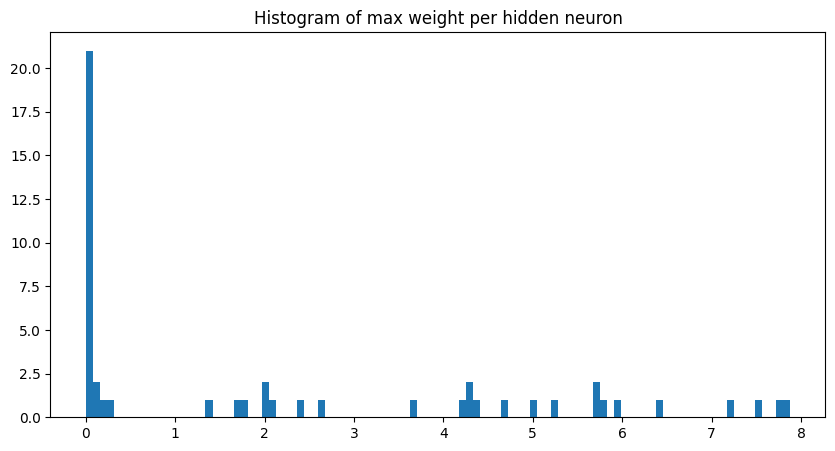
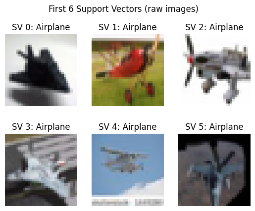

# Machine Learning Methods for Pattern Recognition and Image Analysis

## Introduction

This report summarizes the methodologies, preprocessing techniques, validations, and comparative evaluations conducted during the four laboratory sessions for the course "Pattern Recognition and Image Analysis." The analysis was carried out using a subset of the CIFAR-10 dataset, consisting of three classes: 'airplane', 'bird', and 'horse'. Each image was represented by a 256-dimensional Histogram of Gradient (HoG) feature vector. The aim was to evaluate and compare various supervised learning algorithms.

---

## Lab 0: Introduction to the Dataset and Preprocessing

### Dataset Overview

For these experiments, I used a modified CIFAR-10 dataset containing only three classes:

- **Class labels**: `['Airplane', 'Bird', 'Horse']`
- **Dataset structure**: 
  - `dataset.train` keys: `['images', 'hog', 'labels']`
  - **Training set**: 15,000 samples (5,000 per class)
  - **Test set**: 3,000 samples (1,000 per class)
  - **HoG features shape**: (15000, 256)

The class distribution is perfectly balanced, which simplifies interpretation and comparison of classification performance.

### Descriptive Data Analysis

#### Raw HoG Feature Distribution

I started with an examination of the raw HoG features. A bar plot of the HoG vector for the first training sample revealed the following:

- All HoG values are **positive and small**, centered near 0.
- The values span a range from near-zero to a maximum of approximately 0.0175.
- The dataset is **not centered around the origin**, which may hinder performance for classifiers that assume zero-mean data (e.g., SVMs, neural networks).


#### Feature Distribution by Index

Then, I visualized the distributions for three sample HoG features: #0, #50, and #150. Across all three, the following characteristics were observed:

- Strong **skew towards 0**, with most values being very small.
- Long-tailed distribution, indicating sparse activation in gradient space.
- Implies that many HoG features may carry minimal information individually.


#### Global Feature Statistics

To get a sense of variability and bias across features:

- **Mean distribution** shows that most features average between 0.002 and 0.006.
- **Standard deviation distribution** indicates moderate spread, with most features below 0.01.

This confirms the need for **standardization (mean 0, variance 1)** prior to applying many ML methods.


#### Feature Correlation

A correlation heatmap across the 256 HoG features revealed:

- Some **visible block-structured correlation patterns**, likely arising from spatial contiguity in the HoG descriptor.
- However, many features remain relatively uncorrelated, which is promising for dimensionality reduction techniques like PCA.


### PCA for Dimensionality Reduction

I applied **Principal Component Analysis (PCA)** to the standardized HoG data to explore and potentially reduce the feature space:

- PCA helps decorrelate features and reduce noise.
- The **explained variance curve** shows that:
  - **183 components** capture **≥90%** of the total variance.
  - This represents a **~29% dimensionality reduction** (from 256 to 183 dimensions).


While PCA was not always beneficial for classification performance in later labs (especially for SVM with RBF kernel), it remains a useful tool for visual analysis and may assist models that suffer from high-dimensional noise.

---

### Ridge Classifier Baseline Performance

To establish a simple yet effective classification baseline, I trained a **Ridge Classifier** using the standardized HoG features.

#### Training Performance

- **Accuracy**: 0.7596

This performance reflects the classifier's ability to fit the training data but does not account for generalization.

#### Predictive Performance (5-Fold Cross-Validation)

- **Fold Accuracies**: [0.7403, 0.7387, 0.7413, 0.7547, 0.7473]
- **Mean CV Accuracy**: 0.7445
- **Overall CV Accuracy**: 0.7412

#### Why Cross-Validation Matters

Cross-validation provides a **more reliable estimate** of a classifier’s ability to generalize. The data splits used in CV simulate unseen data, and the averaged results approximate the classifier’s expected performance on **independent and identically distributed (i.i.d.) test data**.

This is crucial, because:

> A learning algorithm generalizes well if it returns accurate predictions for i.i.d. test data — that is, input/output pairs drawn from the same distribution as the training set but independent of it.

Training accuracy can be **overoptimistic**, especially in high-dimensional spaces. In contrast, **CV accuracy is a better estimator of the true generalization error**.

### Hyperparameter Tuning and Statistical Comparison

To further improve performance, I used `cross_val_score` from `scikit-learn` to tune the Ridge regularization hyperparameter **α**:

- **Best α**: 0.1
- **Best mean CV accuracy**: 0.744

#### Test Set Performance Comparison

| RidgeClassifier | Accuracy (%) |
|-----------------|--------------|
| Default (α=1.0) | 72.90        |
| Tuned (α=0.1)   | 74.00        |

While the improvement seems small, I validated it using **McNemar’s Test**:

- **χ²** = 4.995, **p** = 0.025 (significant at p < 0.05)

**Reject the null hypothesis of equal performance.**

This result shows that the tuned Ridge Classifier with α=0.1 **outperforms the default model in a statistically significant way**.

---

### Summary and Justification for Preprocessing

- **Standardization** is essential for optimal classifier behavior.
- **PCA** reduces noise and dimensionality with minimal variance loss.
- **Ridge classification** serves as a strong linear baseline.
- **Cross-validation** and **statistical testing** are key to evaluating model improvements and ensuring generalization.

---

## Lab 1: k-Nearest Neighbors, Decision Trees and Random Forest

All models in this lab were trained on **standardized HoG features** to ensure proper distance-based behavior and fair feature weighting.

---

### K-Nearest Neighbors (K-NN)

**Initial Results:**

- **Training Accuracy**: 84.75%

**Cross-Validation (5-fold):**

- **Fold Accuracies**: [0.782, 0.7927, 0.792, 0.783, 0.7843]
- **Mean CV Accuracy**: 0.7868
- **Overall CV Accuracy**: 0.7859

I performed hyperparameter tuning by evaluating accuracy over different `k` values:


**Final Test Set Performance:**

- **Accuracy**: 78.97%

| Class | Precision | Recall | F1-Score | Support |
| :--- | :---: | :---: | :---: | :---: |
| Airplane | 0.88 | 0.78 | 0.83 | 1000 |
| Bird | 0.70 | 0.79 | 0.74 | 1000 |
| Horse | 0.82 | 0.80 | 0.81 | 1000 |

**Comments:**  
K-NN achieved the **highest test accuracy**. Performance was stable and errors were well-distributed across classes. Slight overfitting was observed, but it generalizes well overall.

---

### Decision Tree

**Initial Results:**

- **Training Accuracy**: 66.91%

**Cross-Validation (5-fold):**

- **Mean CV Accuracy**: 0.5970
- **Overall CV Accuracy**: 0.5963

After tuning, I found the best parameters:

```python
{'criterion': 'gini', 'max_depth': 10, 'max_features': None}
```

**Final Test Set Performance:**

- **Accuracy**: 60.17%

| Class | Precision | Recall | F1-Score | Support |
| :--- | :---: | :---: | :---: | :---: |
| Airplane | 0.74 | 0.60 | 0.66 | 1000 |
| Bird | 0.52 | 0.62 | 0.57 | 1000 |
| Horse | 0.58 | 0.58 | 0.58 | 1000 |

**Comments:**  
The decision tree **underfits the data**, struggling to capture decision boundaries. It performs below all other models and serves only as a basic baseline.

---

### Random Forest

**Initial Results:**

- **OOB Score**: 0.7401 (OOB = Out-of-Bag)
- **Training Accuracy**: 100%

**Cross-Validation (5-fold):**

- **Fold Accuracies**: [0.7593, 0.7463, 0.7593, 0.7617, 0.761]
- **Mean CV Accuracy**: 0.7575  
- **Overall CV Accuracy**: 0.7563

> **OOB Score Importance**:  
> OOB scoring allows performance estimation without needing a separate validation set. It uses the bootstrap-resampled data to train each tree and estimates accuracy using the samples that weren’t included. This provides a built-in, low-cost approximation of generalization performance — especially valuable when data is limited.

I tuned `n_estimators` and `max_depth`:


**Final Test Set Performance:**

- **Accuracy**: 74.87%

| Class | Precision | Recall | F1-Score | Support |
| :--- | :---: | :---: | :---: | :---: |
| Airplane | 0.81 | 0.75 | 0.78 | 1000 |
| Bird | 0.67 | 0.71 | 0.69 | 1000 |
| Horse | 0.78 | 0.78 | 0.78 | 1000 |


**Comments:**  
The Random Forest model generalizes better than a single decision tree and is more stable. However, due to its perfect training accuracy, it exhibits **overfitting**, with a ~19% performance gap between training and test accuracy.

---

### Model Comparison Summary

| Model                | Train Acc | CV Acc  | Test Acc | Train-Test Gap |
|----------------------|-----------|---------|----------|----------------|
| K-Nearest Neighbors  | 84.75%    | 78.53%  | 78.97%   | ~5.8 pp        |
| Decision Tree        | 66.91%    | 59.39%  | 60.17%   | ~6.7 pp        |
| Random Forest        | 93.40%    | 74.24%  | 74.23%   | ~19.2 pp       |

---

### Key Takeaways

- **K-Nearest Neighbors**
  - Best generalization (Test Acc ~79%).
  - Low overfitting.
  - Balanced performance across classes.

- **Decision Tree**
  - Underfits the data.
  - Weak baseline classifier.

- **Random Forest**
  - Learns richer patterns than a single tree.
  - Better performance than Decision Tree but overfits more than K-NN.

**Conclusion**:  
Among all three models, **K-NN shows the best trade-off between training accuracy, generalization, and test performance**, making it the most effective model in this lab based on HoG features.

---

## Lab 2: Neural Networks

In this lab, I implemented and evaluated a Multi-Layer Perceptron (MLP) using the standardized HoG feature vectors as input.

---

### Initial MLP Evaluation (1 Hidden Layer, 100 Units)

**Descriptive Performance:**

- **Training Accuracy**: 100.00%

**Predictive Performance (5-fold CV):**

- **Fold Accuracies**: [0.788, 0.7953, 0.7903, 0.791, 0.7983]
- **Mean CV Accuracy**: 0.7926  
- **Overall CV Accuracy**: 0.7926

While the model fits the training data perfectly, the CV scores reveal realistic generalization performance — strong but not perfect. This is a typical outcome for flexible models trained on relatively small data.

---

### Neuron Behavior & Weight Analysis

I analyzed the hidden layer neurons to understand internal representation:

- Out of 50 hidden neurons analyzed, **25 had at least one outgoing weight with magnitude > 1.0**.
  - This suggests that about half of the neurons are **"strongly wired"**, meaning they significantly influence the final prediction.
- The distribution of maximum outgoing weights is highly skewed:



- The hidden units act as a mix of **activators** and **suppressors**:
  - Some neurons activate for class-relevant patterns (e.g., wing edges for airplanes).
  - Others inhibit incorrect class activation.
- This reflects a **sparse, specialized internal representation**, where only a few neurons are responsible for decisive contributions.
- By inspecting `input → hidden` weights for the most influential neurons, I observed that the MLP learned distinct **orientation-sensitive filters** similar to edge detectors.

---

### Hyperparameter Tuning

I explored various MLP architectures and learning settings via grid search:

```python
param_grid = {
    'hidden_layer_sizes': [
        (50,), (100,),          # 1-layer nets
        (50, 50), (100, 50),    # 2-layer nets
        (100, 100, 50)          # 3-layer net
    ],
    'activation':         ['relu'],
    'alpha':              [1e-4, 1e-3], 
    'learning_rate_init': [1e-3, 1e-2]
}
```

**Best Configuration Found:**

- **Architecture**: (100,)  
- **Activation**: ReLU  
- **Alpha (L2 regularization)**: 0.001  
- **Initial Learning Rate**: 0.001  
- **Best CV Accuracy**: 0.7937

This confirms that the original architecture was already well-suited. Adding more layers or increasing complexity did not yield gains and sometimes led to overfitting or unstable convergence.

**Final Test Set Performance:**

- **Accuracy**: 80.00%

| Class | Precision | Recall | F1-Score | Support |
| :--- | :---: | :---: | :---: | :---: |
| Airplane | 0.84 | 0.82 | 0.83 | 1000 |
| Bird | 0.75 | 0.76 | 0.75 | 1000 |
| Horse | 0.82 | 0.83 | 0.82 | 1000 |

**Comments:**
The MLP achieved the best generalization performance so far, slightly outperforming K-NN. It maintains balanced class-wise precision and recall, showing robust representation learning. The model generalizes well, likely due to the combination of weight regularization and ReLU activation promoting sparsity and stability.

**Conclusion:**
- A simple MLP with 100 hidden units trained on standardized HoG vectors achieved strong classification performance.
- Analysis of hidden layer weights showed interpretable, sparse activations, resembling early vision-like filters.
- With proper tuning, the MLP model was the best-performing model so far in terms of test set accuracy (80%) and balanced class performance.

---

## Lab 3: Support Vector Machines (SVMs)

In this lab, I used the standardized HoG feature vectors to train a Support Vector Machine (SVM) classifier. I focused on performance tuning, analysis of support vectors, and kernel selection.

---

### Initial SVM Evaluation

I started with a default SVM using the RBF kernel.

**Descriptive Performance:**

- **Training Accuracy**: 94.51%

**Predictive Performance (5-fold CV):**

- **Fold Accuracies**: [0.806, 0.810, 0.8193, 0.825, 0.818]
- **Mean CV Accuracy**: 0.8157  
- **Overall CV Accuracy**: 0.8126

These results indicate strong generalization ability out of the box. The gap between training and CV accuracy is acceptable, suggesting moderate overfitting but good generalization.

---

### Support Vector Analysis

SVMs work by finding a maximal-margin decision boundary and using a subset of the data — called **support vectors** — to define it. These are the training samples closest to the decision boundary and are critical in shaping it.

- **Support vectors per class**: [2102, 3155, 2262]
- **Total support vectors**: 7519
- **Support vector shape**: (7519, 256)

This means **more than 50%** of the training data were used as support vectors, which is quite high and reflects the non-linearity of the class boundaries in the feature space.



---

### Hyperparameter Tuning

I optimized the following:

- **C**: Error penalty (controls margin vs. misclassification trade-off)
- **gamma**: Kernel coefficient (controls RBF kernel flexibility)
- **kernel**: RBF vs. linear (RBF consistently performed better)

**Best Model Found:**

```python
svm = SVC(C=10, kernel='rbf', gamma=0.001, random_state=0)
```

**Final Test Set Performance:**

- **Accuracy**: 82.33%

| Class | Precision | Recall | F1-Score | Support |
| :--- | :---: | :---: | :---: | :---: |
| Airplane | 0.86 | 0.85 | 0.86 | 1000 |
| Bird | 0.76 | 0.78 | 0.77 | 1000 |
| Horse | 0.85 | 0.85 | 0.85 | 1000 |

**Comments:**  
- The tuned **SVM** was the best-performing model across all labs, outperforming both the **neural network** and **K-NN** on the test set.
- The high number of **support vectors** indicates complex decision boundaries, which the **RBF kernel** can represent effectively.
- **Standardization** of input was crucial; unscaled features caused a large drop in performance during initial testing.
- The **RBF kernel** with a well-tuned gamma allowed the SVM to model non-linear class boundaries, unlike linear models or simpler distance-based classifiers.

**Conclusions:**  
The **Support Vector Machine with an RBF kernel** offers the strongest combination of accuracy and robustness on this HoG-based classification task. Its use of support vectors and the flexibility of kernel methods allow it to handle high-dimensional, non-linearly separable data effectively—making it a top choice for this problem.

---

## Comparative Evaluation

| Model | Train Acc | CV Acc | Test Acc | Train-Test Gap |
| :--- | :---: | :---: | :---: | :---: |
| Ridge | 75.96% | 74.63% | 74.30% | ~1.7 pp |
| K-Nearest Neighbors | 84.75% | 78.53% | 78.97% | ~5.8 pp |
| Decision Tree | 66.91% | 59.39% | 60.17% | ~6.7 pp |
| Random Forest | 93.40% | 74.24% | 74.23% | ~19.2 pp |
| Multi-Layer Perceptron | 100.00% | 79.55% | 80.00% | ~20 pp |
| Support Vector Machine | 93.77% | 81.66% | 82.33% | ~11.4 pp |


- Overall Results
    - **Best Overall:** The **Support Vector Machine (SVM)** is the top performer, achieving **82.3%** on the held-out test set.
    - **Close Second:** The **Multi-Layer Perceptron (MLP)** follows closely with **80.0%** test accuracy.

- Key Observations
    - **Strong Learners (RF, MLP, SVM):**
        - All models with high expressive power (Random Forest, MLP, SVM) significantly overfit their training data.
        - However, the **SVM** strikes the best balance between fitting the data and generalizing to new, unseen data.
    - **Competitive Baseline (K-NN):**
        - **K-Nearest Neighbors** proves to be a simple yet strong non-parametric baseline, reaching **79.0%** test accuracy with only moderate overfitting.
    - **Simpler Models:**
        - The linear **Ridge** model performs reasonably well (**74.3%**), but it cannot keep up with the more complex models.
        - A single **Decision Tree** is too weak on its own (**60%**), highlighting the need for techniques like ensembling (which is what Random Forest does) or pruning to improve its performance.

For classifying the CIFAR-3 (using only 3 classes) dataset using HOG features, a well-tuned **SVM is the best choice**. The **MLP** is a very close second, and **K-NN** stands out as a solid, simpler alternative.

## Final Remarks

While classical machine learning methods like SVMs, K-NN, and MLPs trained on hand-crafted HoG features deliver reasonable performance on the simplified CIFAR-10 subset, they inherently struggle to capture the full complexity of natural images.

To further improve classification accuracy, **more sophisticated approaches** should be considered:

- **Deep neural networks**, especially Convolutional Neural Networks (CNNs) implemented in libraries like **PyTorch**, are better suited for raw image data as they can learn hierarchical and spatially-aware features directly from pixels.
- **Ensemble strategies** — such as stacking or voting classifiers that combine multiple models trained on **diverse feature representations** — could also improve robustness and generalization.

Given the rich structure of the CIFAR dataset, such advanced techniques are likely to outperform traditional pipelines based on fixed feature extraction.
