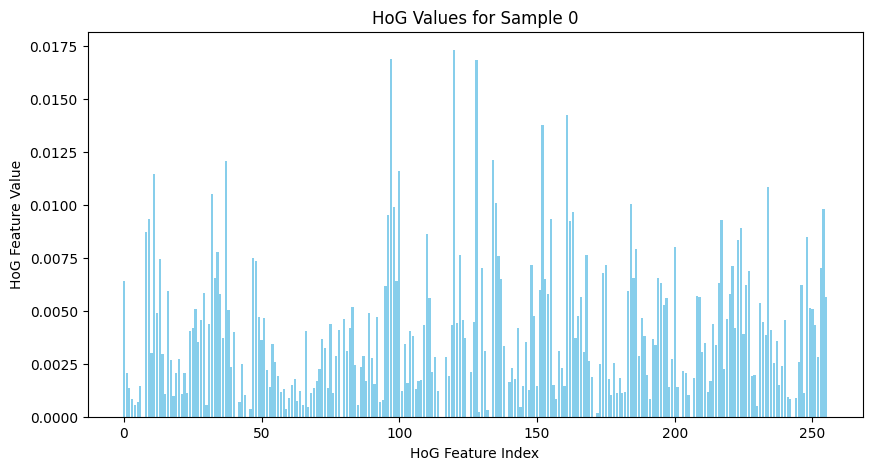
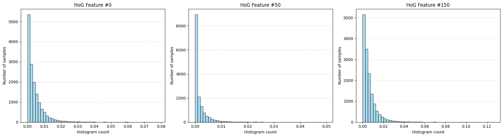
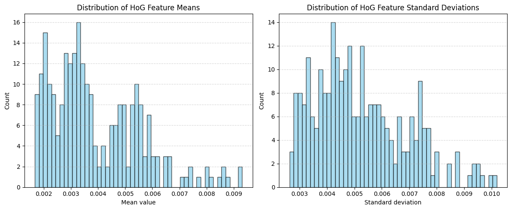
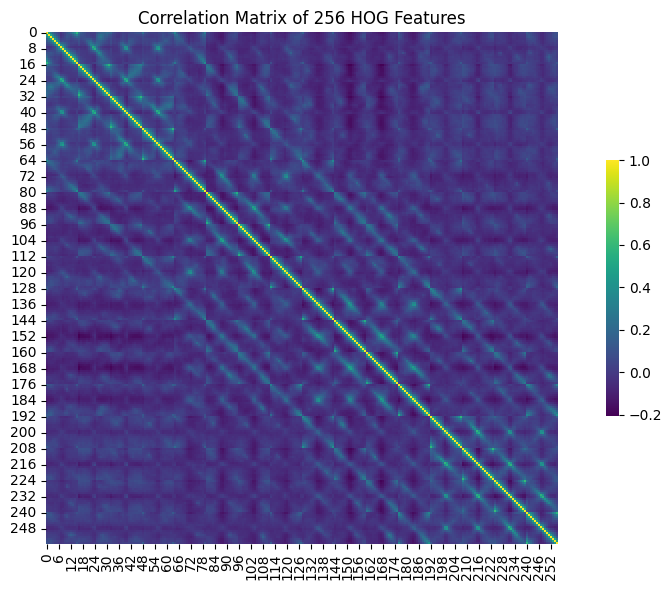
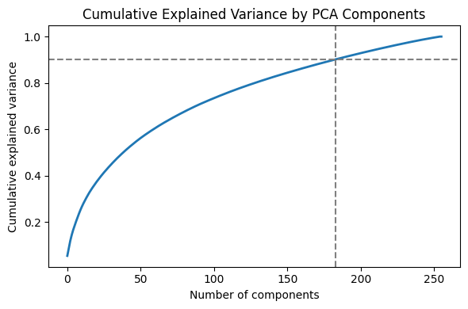
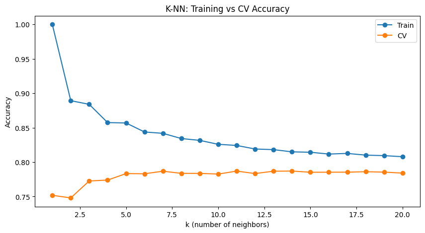

# Machine Learning Methods for Pattern Recognition and Image Analysis

## Introduction

This report summarizes the methodologies, preprocessing techniques, validations, and comparative evaluations conducted during the four laboratory sessions for the course "Pattern Recognition and Image Analysis." The analysis was carried out using a subset of the CIFAR-10 dataset, consisting of three classes: 'airplane', 'bird', and 'horse'. Each image was represented by a 256-dimensional Histogram of Gradient (HoG) feature vector. The aim was to evaluate and compare various supervised learning algorithms.

---

## Lab 0: Introduction to the Dataset and Preprocessing

### Dataset Overview

For these experiments, we used a modified CIFAR-10 dataset containing only three classes:

- **Class labels**: `['Airplane', 'Bird', 'Horse']`
- **Dataset structure**: 
  - `dataset.train` keys: `['images', 'hog', 'labels']`
  - **Training set**: 15,000 samples (5,000 per class)
  - **Test set**: 3,000 samples (1,000 per class)
  - **HoG features shape**: (15000, 256)

The class distribution is perfectly balanced, which simplifies interpretation and comparison of classification performance.

### Descriptive Data Analysis

#### Raw HoG Feature Distribution

We started with an examination of the raw HoG features. A bar plot of the HoG vector for the first training sample revealed the following:

- All HoG values are **positive and small**, centered near 0.
- The values span a range from near-zero to a maximum of approximately 0.0175.
- The dataset is **not centered around the origin**, which may hinder performance for classifiers that assume zero-mean data (e.g., SVMs, neural networks).



#### Feature Distribution by Index

We then visualized the distributions for three sample HoG features: #0, #50, and #150. Across all three, the following characteristics were observed:

- Strong **skew towards 0**, with most values being very small.
- Long-tailed distribution, indicating sparse activation in gradient space.
- Implies that many HoG features may carry minimal information individually.



#### Global Feature Statistics

To get a sense of variability and bias across features:

- **Mean distribution** shows that most features average between 0.002 and 0.006.
- **Standard deviation distribution** indicates moderate spread, with most features below 0.01.

This confirms the need for **standardization (mean 0, variance 1)** prior to applying many ML methods.



#### Feature Correlation

A correlation heatmap across the 256 HoG features revealed:

- Some **visible block-structured correlation patterns**, likely arising from spatial contiguity in the HoG descriptor.
- However, many features remain relatively uncorrelated, which is promising for dimensionality reduction techniques like PCA.



### PCA for Dimensionality Reduction

We applied **Principal Component Analysis (PCA)** to the standardized HoG data to explore and potentially reduce the feature space:

- PCA helps decorrelate features and reduce noise.
- The **explained variance curve** shows that:
  - **183 components** capture **≥90%** of the total variance.
  - This represents a **~29% dimensionality reduction** (from 256 to 183 dimensions).



While PCA was not always beneficial for classification performance in later labs (especially for SVM with RBF kernel), it remains a useful tool for visual analysis and may assist models that suffer from high-dimensional noise.

---

### Ridge Classifier Baseline Performance

To establish a simple yet effective classification baseline, we trained a **Ridge Classifier** using the standardized HoG features.

#### Training Performance

- **Accuracy**: 0.7596

This performance reflects the classifier's ability to fit the training data but does not account for generalization.

#### Predictive Performance (5-Fold Cross-Validation)

- **Fold Accuracies**: [0.7403, 0.7387, 0.7413, 0.7547, 0.7473]
- **Mean CV Accuracy**: 0.7445
- **Overall CV Accuracy**: 0.7412

#### Why Cross-Validation Matters

Cross-validation provides a **more reliable estimate** of a classifier’s ability to generalize. The data splits used in CV simulate unseen data, and the averaged results approximate the classifier’s expected performance on **independent and identically distributed (i.i.d.) test data**.

This is crucial, because:

> A learning algorithm generalizes well if it returns accurate predictions for i.i.d. test data — that is, input/output pairs drawn from the same distribution as the training set but independent of it.

Training accuracy can be **overoptimistic**, especially in high-dimensional spaces. In contrast, **CV accuracy is a better estimator of the true generalization error**.

### Hyperparameter Tuning and Statistical Comparison

To further improve performance, we used `cross_val_score` from `scikit-learn` to tune the Ridge regularization hyperparameter **α**:

- **Best α**: 0.1
- **Best mean CV accuracy**: 0.744

#### Test Set Performance Comparison

| RidgeClassifier | Accuracy (%) |
|-----------------|--------------|
| Default (α=1.0) | 72.90        |
| Tuned (α=0.1)   | 74.00        |

While the improvement seems small, we validated it using **McNemar’s Test**:

- **χ²** = 4.995, **p** = 0.025 (significant at p < 0.05)

**We reject the null hypothesis of equal performance.**

This result shows that the tuned Ridge Classifier with α=0.1 **outperforms the default model in a statistically significant way**.

---

### Summary and Justification for Preprocessing

- **Standardization** is essential for optimal classifier behavior.
- **PCA** reduces noise and dimensionality with minimal variance loss.
- **Ridge classification** serves as a strong linear baseline.
- **Cross-validation** and **statistical testing** are key to evaluating model improvements and ensuring generalization.

---

## Lab 1: k-Nearest Neighbors, Decision Trees and Random Forest

All models in this lab were trained on **standardized HoG features** to ensure proper distance-based behavior and fair feature weighting.

---

### K-Nearest Neighbors (K-NN)

**Initial Results:**

- **Training Accuracy**: 84.75%

**Cross-Validation (5-fold):**

- **Fold Accuracies**: [0.782, 0.7927, 0.792, 0.783, 0.7843]
- **Mean CV Accuracy**: 0.7868
- **Overall CV Accuracy**: 0.7859

We performed hyperparameter tuning by evaluating accuracy over different `k` values:



**Final Test Set Performance:**

- **Accuracy**: 78.97%

| Class | Precision | Recall | F1-Score | Support |
| :--- | :---: | :---: | :---: | :---: |
| Airplane | 0.88 | 0.78 | 0.83 | 1000 |
| Bird | 0.70 | 0.79 | 0.74 | 1000 |
| Horse | 0.82 | 0.80 | 0.81 | 1000 |

**Comments:**  
K-NN achieved the **highest test accuracy**. Performance was stable and errors were well-distributed across classes. Slight overfitting was observed, but it generalizes well overall.

---

### Decision Tree

**Initial Results:**

- **Training Accuracy**: 66.91%

**Cross-Validation (5-fold):**

- **Mean CV Accuracy**: 0.5970
- **Overall CV Accuracy**: 0.5963

After tuning, we found the best parameters:

```python
{'criterion': 'gini', 'max_depth': 10, 'max_features': None}
```

**Final Test Set Performance:**

- **Accuracy**: 60.17%

| Class | Precision | Recall | F1-Score | Support |
| :--- | :---: | :---: | :---: | :---: |
| Airplane | 0.74 | 0.60 | 0.66 | 1000 |
| Bird | 0.52 | 0.62 | 0.57 | 1000 |
| Horse | 0.58 | 0.58 | 0.58 | 1000 |

**Comments:**  
The decision tree **underfits the data**, struggling to capture decision boundaries. It performs below all other models and serves only as a basic baseline.

---

### Random Forest

**Initial Results:**

- **OOB Score**: 0.7401 (OOB = Out-of-Bag)
- **Training Accuracy**: 100%

**Cross-Validation (5-fold):**

- **Fold Accuracies**: [0.7593, 0.7463, 0.7593, 0.7617, 0.761]
- **Mean CV Accuracy**: 0.7575  
- **Overall CV Accuracy**: 0.7563

> **OOB Score Importance**:  
> OOB scoring allows performance estimation without needing a separate validation set. It uses the bootstrap-resampled data to train each tree and estimates accuracy using the samples that weren’t included. This provides a built-in, low-cost approximation of generalization performance — especially valuable when data is limited.

We tuned `n_estimators` and `max_depth`:


**Final Test Set Performance:**

- **Accuracy**: 74.87%

| Class | Precision | Recall | F1-Score | Support |
| :--- | :---: | :---: | :---: | :---: |
| Airplane | 0.81 | 0.75 | 0.78 | 1000 |
| Bird | 0.67 | 0.71 | 0.69 | 1000 |
| Horse | 0.78 | 0.78 | 0.78 | 1000 |


**Comments:**  
The Random Forest model generalizes better than a single decision tree and is more stable. However, due to its perfect training accuracy, it exhibits **overfitting**, with a ~19% performance gap between training and test accuracy.

---

### Model Comparison Summary

| Model                | Train Acc | CV Acc  | Test Acc | Train-Test Gap |
|----------------------|-----------|---------|----------|----------------|
| K-Nearest Neighbors  | 84.75%    | 78.53%  | 78.97%   | ~5.8 pp        |
| Decision Tree        | 66.91%    | 59.39%  | 60.17%   | ~6.7 pp        |
| Random Forest        | 93.40%    | 74.24%  | 74.23%   | ~19.2 pp       |

---

### Key Takeaways

- **K-Nearest Neighbors**
  - Best generalization (Test Acc ~79%).
  - Low overfitting.
  - Balanced performance across classes.

- **Decision Tree**
  - Underfits the data.
  - Weak baseline classifier.

- **Random Forest**
  - Learns richer patterns than a single tree.
  - Better performance than Decision Tree but overfits more than K-NN.

**Conclusion**:  
Among all three models, **K-NN shows the best trade-off between training accuracy, generalization, and test performance**, making it the most effective model in this lab based on HoG features.

---

## Lab 2: Neural Networks

### Methodologies:
- Multi-layer Perceptron (MLP) with one hidden layer (ReLU activation).
- Trained using backpropagation and SGD.

### Preprocessing:
- Input normalization applied.
- No PCA, as neural networks can internally learn representations.

### Validation:
- Performance tracked using training/test split.
- Accuracy and loss curves used to diagnose under/overfitting.

### Results:
- Good performance with appropriate regularization (dropout).
- Network capacity directly impacted accuracy.
- High variance without regularization.

### Insights:
- Neural Networks handle high-dimensional data well.
- Require hyperparameter tuning (e.g., hidden size, learning rate).
- Sensitive to training size and initialization.

---

## Lab 3: Support Vector Machines (SVM)

### Methodologies:
- Linear and RBF kernel SVMs evaluated.
- Grid search for hyperparameters (`C`, `gamma`).

### Preprocessing:
- Standardization of HoG features crucial.
- PCA tested for dimensionality reduction, but full HoG outperformed PCA-reduced input.

### Validation:
- Grid search with cross-validation.
- Accuracy compared across kernels and parameter settings.

### Results:
- RBF kernel outperformed linear SVM, capturing non-linear boundaries.
- Best performance when using full-dimensional HoG with RBF and tuned parameters.

### Insights:
- SVMs robust and effective for small-medium datasets.
- RBF kernel well-suited for complex class boundaries.
- PCA hurt performance slightly due to information loss.

---

## Comparative Evaluation

| Method           | Preprocessing        | Accuracy | Notes |
|------------------|----------------------|----------|-------|
| k-NN             | Normalization        | Moderate | Fast, simple, but sensitive to `k` |
| Decision Tree    | None                 | Low-Moderate | Prone to overfitting, interpretable |
| Neural Network   | Normalization        | High     | Needs tuning and regularization |
| SVM (RBF)        | Normalization        | Very High| Best performer with tuning |

**Why Some Methods Perform Better:**
- SVM with RBF kernel handles non-linear boundaries effectively.
- Neural networks excel with sufficient data and regularization.
- Simpler methods like k-NN and Decision Trees suffer from high variance and bias, respectively.

---

## Recommendations for Improvement

- **Feature Engineering**: Explore additional descriptors beyond HoG, such as color histograms or deep features.
- **Data Augmentation**: Enrich training data with image transformations to improve generalization.
- **Ensemble Methods**: Combine classifiers (e.g., bagging for trees, voting ensembles).
- **Hyperparameter Optimization**: Automated tuning (e.g., grid/random search, Bayesian optimization).
- **Model Calibration**: Apply softmax or Platt scaling for probability estimates.

---

## Conclusion

Each classifier demonstrates unique strengths and limitations in the context of pattern recognition. SVMs and neural networks clearly outperform simpler models due to their ability to model non-linear patterns in high-dimensional feature spaces. Preprocessing like normalization and validation strategies like cross-validation are critical for reliable evaluation. With additional improvements such as data augmentation and feature expansion, performance could be further enhanced.
